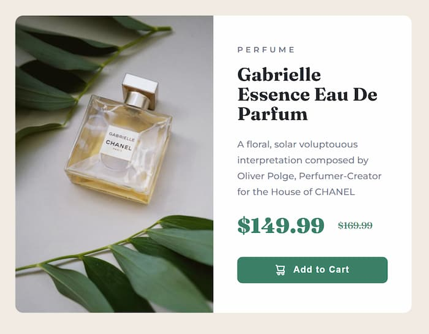

# Product Preview Card Component

A responsive product preview card component built with HTML and CSS. This project features a modern e-commerce card design showcasing a perfume product with pricing, description, and call-to-action button.

## Preview

The component displays a beautiful product card with:

- Responsive product image (desktop and mobile versions)
- Product category label
- Product title and description
- Price display with original and discounted prices
- Interactive "Add to Cart" button

### Desktop Preview



### Mobile Preview


## Features

- 🎨 Clean and elegant UI design
- 📱 Fully responsive (Desktop, Tablet, and Mobile)
- 🖼️ Optimized images with `<picture>` element
- 🔤 Google Fonts integration (Montserrat & Fraunces)
- ♿ Semantic HTML structure
- 🎯 Hover effects on interactive elements
- ⚡ Lazy loading for images

## Technologies Used

- HTML5
- CSS3
- Google Fonts (Montserrat, Fraunces)
- Responsive Images with `<picture>` element

## Project Structure

```
project-root/
│
├── index.html          # Main HTML file
├── style.css           # Stylesheet
├── README.md           # Project Documentation
└── Images/
    ├── image-product-desktop.jpg  # Desktop product image
    ├── image-product-mobile.jpg   # Mobile product image
    ├── icon-cart.svg              # Shopping cart icon
    └── screenshots/
        ├── desktop-preview.png    # Desktop screenshot
        └── mobile-preview.png     # Mobile screenshot
```

## Installation

1. Clone or download this repository
2. Ensure all product images are placed in the `Images` folder
3. Open `index.html` in your web browser

## Usage

Click the [Demo App Link](https://simple-product-preview-card-component.vercel.app/)

## Design Specifications

### Colors

- **Background**: `hsl(30, 38%, 92%)` - Cream
- **Card Background**: `hsl(0, 0%, 100%)` - White
- **Primary Color**: `hsl(158, 36%, 37%)` - Dark cyan
- **Primary Hover**: `hsl(158, 42%, 18%)` - Very dark cyan
- **Title Color**: `hsl(212, 21%, 14%)` - Very dark blue
- **Text Color**: `hsl(228, 12%, 48%)` - Dark grayish blue

### Typography

- **Body Font**: Montserrat (Google Fonts)
- **Display Font**: Fraunces (Google Fonts)
- **Base Font Size**: 14px
- **Category Font Size**: 12px (uppercase, letter-spacing: 4px)
- **Product Title**: 28px (Fraunces, line-height: 1.05)
- **Price Font Size**: 32px (Fraunces, weight: 900)

### Layout

- **Desktop Card Width**: 600px (max)
- **Card Border Radius**: 12px
- **Text Padding**: 36px
- **Button Padding**: 12px 24px
- **Responsive Breakpoints**:
  - Tablet: 640px
  - Mobile: 440px

## Customization

You can easily customize the component by modifying values in `style.css`:

- Change color scheme by updating the HSL values
- Adjust card dimensions by modifying max-width and padding
- Update typography by changing font families and sizes
- Modify breakpoints for different responsive behavior
- Customize button styles and hover effects

## Browser Support

This component works on all modern browsers:

- Chrome
- Firefox
- Safari
- Edge
- Opera

## Credits

This project is a solution for a Frontend Mentor challenge, designed to help improve front-end coding skills through practical e-commerce component development.

## License

This project is open source and available for personal and educational use.
